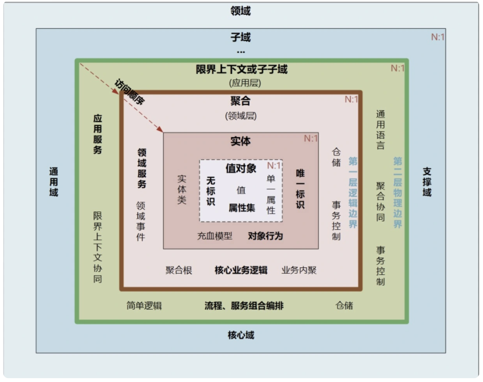
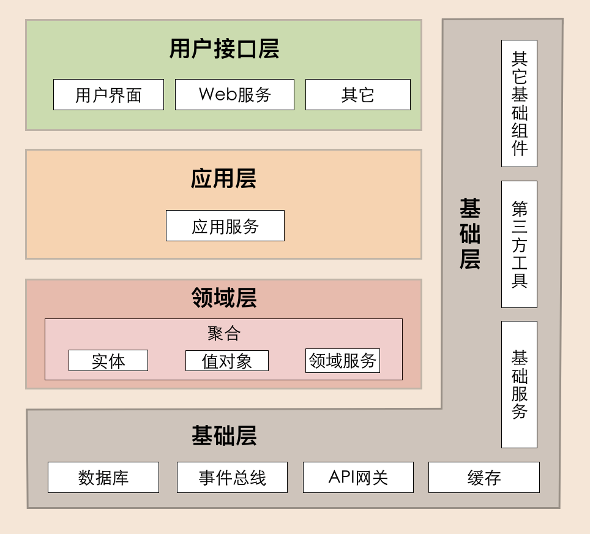
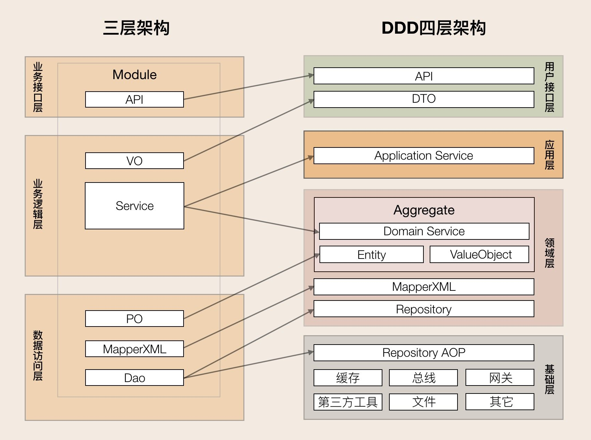

#从MVC到DDD的架构演进

> DDD这几年越来越火 

##从DDD的角度看MVC架构的问题
####代码角度： 
 + 瘦实体模型：只起到数据类的作用，业务逻辑散落到service，可维护性越来越差；
 + 面向数据库表编程，而非模型编程；
 + 实体类之间的关系是复杂的网状结构，成为大泥球，牵一发而动全身，导致不敢轻易改代码；
 + service类承接的所有的业务逻辑，越来越臃肿，很容易出现几千行的service类；
 + 对外接口直接暴露实体模型，导致不必要开放内部逻辑对外暴露，就算有DTO类一般也是实体类的直接copy；
 + 外部依赖层直接从service层调用，字段转换、异常处理大量充斥在service方法中；
 
####项目管理角度：
 + 交付效率：越来越低；
 + 稳定性差：不好测试，代码改动的影响范围不好预估；
 + 理解成本高：新成员介入成本高，长期会导致模块只有一个人最熟悉，离职成本很大；

 
##第一层：初出茅庐
####DDD主要概念：
+ 领域
+ 子域
+ 核心域
+ 通用域
+ 支撑域
+ 实体
+ 值对象
+ 聚合
+ 聚合根
+ 通用语言
+ 限界上下文
+ 事件风暴
+ 领域事件
+ 领域服务
+ 应用服务
+ 工厂
+ 资源库

下图：

---
+ 领域和子域
>+ 在研究和解决业务问题时，DDD 会按照一定的规则将业务领域进行细分，当领域细分到一定的程度后，DDD 会将问题范围限定在特定的边界内，在这个边界内建立领域模型，进而用代码实现该领域模型，解决相应的业务问题。简言之，DDD 的领域就是这个边界内要解决的业务问题域。
>+ 领域可以进一步划分为子领域。我们把划分出来的多个子领域称为子域，每个子域对应一个更小的问题域或更小的业务范围。
>+ 领域的核心思想就是将问题域逐级细分，来降低业务理解和系统实现的复杂度。通过领域细分，逐步缩小服务需要解决的问题域，构建合适的领域模型。
>+ 举个例子，比如保险领域，我们可以把保险细分为承保、收付、再保以及理赔等子域，而承保子域还可以继续细分为投保、保全（寿险）、批改（财险）等子子域。
---
+ 核心域、通用域和支撑域
>+ 子域可以根据重要程度和功能属性划分为如下：
>  + 核心域：决定产品和公司核心竞争力的子域，它是业务成功的主要因素和公司的核心竞争力。
>  + 通用域：没有太多个性化的诉求，同时被多个子域使用的通用功能的子域。
>  + 支撑域：但既不包含决定产品和公司核心竞争力的功能，也不包含通用功能的子域。
>+ 核心域、支撑域和通用域的主要目标是：通过领域划分，区分不同子域在公司内的不同功能属性和重要性，从而公司可对不同子域采取不同的资源投入和建设策略，其关注度也会不一样。
>+ 很多公司的业务，表面看上去相似，但商业模式和战略方向是存在很大差异的，因此公司的关注点会不一样，在划分核心域、通用域和支撑域时，其结果也会出现非常大的差异。
>+ 比如同样都是电商平台的淘宝、天猫、京东和苏宁易购，他们的商业模式是不同的。淘宝是 C2C 网站，个人卖家对个人买家，而天猫、京东和苏宁易购则是 B2C 网站，是公司卖家对个人买家。即便是苏宁易购与京东都是 B2C 的模式，苏宁易购是典型的传统线下卖场转型成为电商，京东则是直营加部分平台模式。因此，在公司建立领域模型时，我们就要结合公司战略重点和商业模式，重点关注核心域。
---
+  通用语言和限界上下文
>+ 通用语言：就是能够简单、清晰、准确描述业务涵义和规则的语言。
>  + 通用语言是团队统一的语言，不管你在团队中承担什么角色，在同一个领域的软件生命周期里都使用统一的语言进行交流。那么，通用语言的价值也就很明了，它可以解决交流障碍这个问题，使领域专家和开发人员能够协同合作，从而确保业务需求的正确表达。
>   这个通用语言到场景落地，大家可能还很模糊，其实就是把领域对象、属性、代码模型对象等，通过代码和文字建立映射关系，可以通过Excel记录这个关系，这样研发可以通过代码知道这个含义，产品或者业务方可以通过文字知道这个含义，沟通起来就不会有歧义，说的简单一点，其实就是统一产品和研发的话术。
>+ 限界上下文：用来封装通用语言和领域对象，提供上下文环境，保证在领域之内的一些术语、业务相关对象等（通用语言）有一个确切的含义，没有二义性。
>  + 通用语言也有它的上下文环境，为了避免同样的概念或语义在不同的上下文环境中产生歧义，DDD 在战略设计上提出了“限界上下文”这个概念，用来确定语义所在的领域边界。
>  + 限界上下文是一个显式的语义和语境上的边界，领域模型便存在于边界之内。边界内，通用语言中的所有术语和词组都有特定的含义。把限界上下文拆解开看，限界就是领域的边界，而上下文则是语义环境。通过领域的限界上下文，我们就可以在统一的领域边界内用统一的语言进行交流。

---
+ 实体和值对象
>+ 实体 = 唯一身份标识 + 可变性【状态 + 行为】
>  + DDD中要求实体是唯一的且可持续变化的。意思是说在实体的生命周期内，无论其如何变化，其仍旧是同一个实体。唯一性由唯一的身份标识来决定的。可变性也正反映了实体本身的状态和行为。
实体以 DO（领域对象）的形式存在，每个实体对象都有唯一的 ID。我们可以对一个实体对象进行多次修改，修改后的数据和原来的数据可能会大不相同。但是，由于它们拥有相同的 ID，它们依然是同一个实体。比如商品是商品上下文的一个实体，通过唯一的商品 ID 来标识，不管这个商品的数据如何变化，商品的 ID 一直保持不变，它始终是同一个商品。
>+ 值对象：将一个值用对象的方式进行表述，来表达一个具体的固定不变的概念。
>  + 当你只关心某个对象的属性时，该对象便可作为一个值对象。 我们需要将值对象看成不变对象，不要给它任何身份标识，还应该尽量避免像实体对象一样的复杂性。
>  + 还是举个订单的例子，订单是一个实体，里面包含地址，这个地址可以只通过属性嵌入的方式形成的订单实体对象，也可以将地址通过json序列化一个string类型的数据，存到DB的一个字段中，那么这个Json串就是一个值对象，是不是很好理解？下面给个简单的图（同样是源于极客时间欧创新的DDD实战课）：

---

+ 聚合和聚合根
>+ 聚合
>  + 聚合：我们把一些关联性极强、生命周期一致的实体、值对象放到一个聚合里。聚合是领域对象的显式分组，旨在支持领域模型的行为和不变性，同时充当一致性和事务性边界。
>  + 聚合有一个聚合根和上下文边界，这个边界根据业务单一职责和高内聚原则，定义了聚合内部应该包含哪些实体和值对象，而聚合之间的边界是松耦合的。按照这种方式设计出来的服务很自然就是“高内聚、低耦合”的。
>  + 聚合在 DDD 分层架构里属于领域层，领域层包含了多个聚合，共同实现核心业务逻辑。跨多个实体的业务逻辑通过领域服务来实现，跨多个聚合的业务逻辑通过应用服务来实现。比如有的业务场景需要同一个聚合的 A 和 B 两个实体来共同完成，我们就可以将这段业务逻辑用领域服务来实现；而有的业务逻辑需要聚合 C 和聚合 D 中的两个服务共同完成，这时你就可以用应用服务来组合这两个服务。
>+ 聚合根
>  + 如果把聚合比作组织，那聚合根就是这个组织的负责人。聚合根也称为根实体，它不仅是实体，还是聚合的管理者。
>  + 首先它作为实体本身，拥有实体的属性和业务行为，实现自身的业务逻辑。
>  + 其次它作为聚合的管理者，在聚合内部负责协调实体和值对象按照固定的业务规则协同完成共同的业务逻辑。
>  + 最后在聚合之间，它还是聚合对外的接口人，以聚合根 ID 关联的方式接受外部任务和请求，在上下文内实现聚合之间的业务协同。也就是说，聚合之间通过聚合根 ID 关联引用，如果需要访问其它聚合的实体，就要先访问聚合根，再导航到聚合内部实体，外部对象不能直接访问聚合内实体。
 
 
---
+ 领域服务和应用服务
>+ 领域服务
>  + 当一些逻辑不属于某个实体时，可以把这些逻辑单独拿出来放到领域服务中，理想的情况是没有领域服务，如果领域服务使用不恰当，慢慢又演化回了以前逻辑都在service层的局面。
>+ 可以使用领域服务的情况：
>  + 执行一个显著的业务操作
>  + 对领域对象进行转换
>  + 以多个领域对象作为输入参数进行计算，结果产生一个值对象 
>+ 应用服务
>  + 应用层作为展现层与领域层的桥梁，是用来表达用例和用户故事的主要手段。
>  + 应用层通过应用服务接口来暴露系统的全部功能。在应用服务的实现中，它负责编排和转发，它将要实现的功能委托给一个或多个领域对象来实现，它本身只负责处理业务用例的执行顺序以及结果的拼装。通过这样一种方式，它隐藏了领域层的复杂性及其内部实现机制。
>  + 应用层相对来说是较“薄”的一层，除了定义应用服务之外，在该层我们可以进行安全认证，权限校验，持久化事务控制，或者向其他系统发生基于事件的消息通知，另外还可以用于创建邮件以发送给客户等。
>  + 我理解应用层，主要是处理一些业务逻辑，如果业务的处理非常复杂，我觉得这一层并不“薄”，比如商城的下单和支付业务，涉及的业务渠道和支付方式非常多，且每一种渠道的处理逻辑还不一样，所以从个人经验来看在，这一层应用层还是非常复杂的。
---
+ 领域事件
>+ 领域事件 = 事件发布 + 事件存储 + 事件分发 + 事件处理。
>  + 领域事件是一个领域模型中极其重要的部分，用来表示领域中发生的事件。忽略不相关的领域活动，同时明确领域专家要跟踪或希望被通知的事情，或与其他模型对象中的状态更改相关联，下面简单说明领域事件：
>  + 事件发布：构建一个事件，需要唯一标识，然后发布；
>  + 事件存储：发布事件前需要存储，因为接收后的事建也会存储，可用于重试或对账等；
>  + 事件分发：服务内直接发布给订阅者，服务外需要借助消息中间件，比如Kafka，RabbitMQ等；
>  + 事件处理：先将事件存储，然后再处理。
>+ 比如下订单后，给用户增长积分与赠送优惠券的需求。如果使用瀑布流的方式写代码。一个个逻辑调用，那么不同用户，赠送的东西不同，逻辑就会变得又臭又长。这里的比较好的方式是，用户下订单成功后，发布领域事件，积分聚合与优惠券聚合监听订单发布的领域事件进行处理。
>+ 我开始还以为“领域事件”是一种特殊的事件，后来我找了比较多的文章，发现领域事件其实就是把异步IO包装成另外一种说法，也就是通过异步方式实现系统的解耦，这个在MVC中使用也很常见嘛，唯一的区别就是领域事件在发布方和订阅方一定需要存储。这个在极客时间中花了整整一个篇幅来讲解“领域事件”，对于我个人来说，这块知识点收获很小，文章主要是将异步的方式，结合微服务和具体的业务场景进行讲解。
 
--- 
+ 工厂
>+ 按照个人理解，工厂的概念其实并不属于领域驱动的范畴，它其实是实现领域驱动相关功能的一种方式，用于构建领域模型、聚合根和领域服务等。
>+ 领域模型中的工厂：
>  + 将创建复杂对象和聚合的职责分配给一个单独的对象，它并不承担领域模型中的职责，但是领域设计的一部份；
>  + 对于聚合来说，我们应该一次性的创建整个聚合，并且确保它的不变条件得到满足；
>  + 工厂只承担创建模型的工作，不具有其它领域行为；
>  + 一个含有工厂方法的聚合根的主要职责是完成它的聚合行为；
>  + 在聚合上使用工厂方法能更好的表达通用语言，这是使用构造函数所不能表达的。
>+ 聚合根中的工厂：
>  + 聚合根中的工厂方法表现出了领域概念；
>  + 工厂方法可以提供守卫措施。
>+ 领域服务中的工厂：
>  + 在集成限界上下文时，领域服务作为工厂；
>  + 领域服务的接口放在领域模型内，实现放在基础设施层。
---
+ 资源库【仓储】
>+ 是聚合的管理，仓储介于领域模型和数据模型之间，主要用于聚合的持久化和检索。它隔离了领域模型和数据模型，以便我们关注于领域模型而不需要考虑如何进行持久化。
>+ 我们将暂时不使用的领域对象从内存中持久化存储到磁盘中。当日后需要再次使用这个领域对象时，根据 key 值到数据库查找到这条记录，然后将其恢复成领域对象，应用程序就可以继续使用它了，这就是领域对象持久化存储的设计思想
 

####DDD的分层架构：
+ 应用层{application}
>1. 应用服务位于应用层。用来表述应用和用户行为，负责服务的组合、编排和转发，负责处理业务用例的执行顺序以及结果的拼装。
>2. 应用层的服务包括应用服务和领域事件相关服务。
>3. 应用服务可对微服务内的领域服务以及微服务外的应用服务进行组合和编排，或者对基础层如文件、缓存等数据直接操作形成应用服务，对外提供粗粒度的服务。
>4. 领域事件服务包括两类：领域事件的发布和订阅。通过事件总线和消息队列实现异步数据传输，实现微服务之间的解耦。

+ 领域层{domain}
>或称为模型层，系统的核心，负责表达业务概念，业务状态信息以及业务规则。即包含了该领域（问题域）所有复杂的业务知识抽象和规则定义。该层主要精力要放在领域对象分析上，可以从实体，值对象，聚合（聚合根），领域服务，领域事件，仓储，工厂等方面入手。
>1. 领域服务位于领域层，为完成领域中跨实体或值对象的操作转换而封装的服务，领域服务以与实体和值对象相同的方式参与实施过程。
>2. 领域服务对同一个实体的一个或多个方法进行组合和封装，或对多个不同实体的操作进行组合或编排，对外暴露成领域服务。领域服务封装了核心的业务逻辑。实体自身的行为在实体类内部实现，向上封装成领域服务暴露。
>3. 为隐藏领域层的业务逻辑实现，所有领域方法和服务等均须通过领域服务对外暴露。
>4. 为实现微服务内聚合之间的解耦，原则上禁止跨聚合的领域服务调用和跨聚合的数据相互关联。

+ 基础层{infrastructrue}
>1. 基础服务位于基础层。为各层提供资源服务（如数据库、缓存等），实现各层的解耦，降低外部资源变化对业务逻辑的影响。
>2. 基础服务主要为仓储服务，通过依赖反转的方式为各层提供基础资源服务，领域服务和应用服务调用仓储服务接口，利用仓储实现持久化数据对象或直接访问基础资源。

+ 接口层{interfaces}
>1. 接口服务位于用户接口层，用于处理用户发送的Restful请求和解析用户输入的配置文件等，并将信息传递给应用层。
 

####MVC架构到DDD分层架构的映射：

##第二层：草船借箭（战术设计）

 

