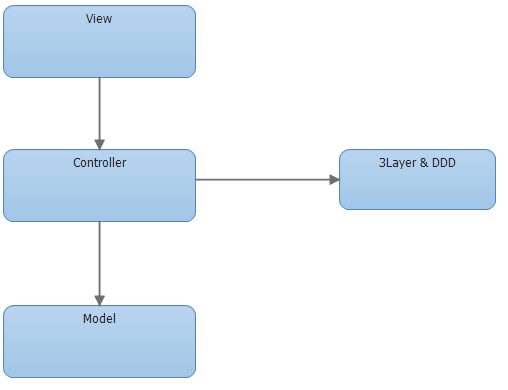
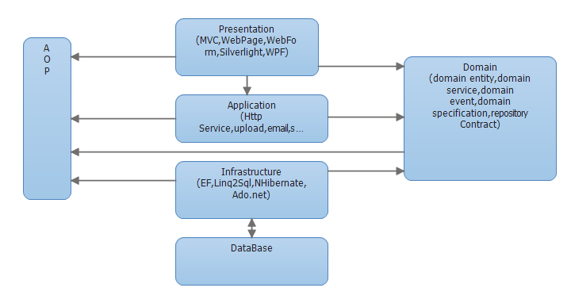

#从MVC到DDD的架构演进

> DDD这几年越来越火 

##从DDD的角度看MVC架构的问题
####代码角度： 
 + 瘦实体模型：只起到数据类的作用，业务逻辑散落到service，可维护性越来越差；
 + 面向数据库表编程，而非模型编程；
 + 实体类之间的关系是复杂的网状结构，成为大泥球，牵一发而动全身，导致不敢轻易改代码；
 + service类承接的所有的业务逻辑，越来越臃肿，很容易出现几千行的service类；
 + 对外接口直接暴露实体模型，导致不必要开放内部逻辑对外暴露，就算有DTO类一般也是实体类的直接copy；
 + 外部依赖层直接从service层调用，字段转换、异常处理大量充斥在service方法中；
 
####项目管理角度：
 + 交付效率：越来越低；
 + 稳定性差：不好测试，代码改动的影响范围不好预估；
 + 理解成本高：新成员介入成本高，长期会导致模块只有一个人最熟悉，离职成本很大；

##MVC架构到DDD架构的演化
 &nbsp;&nbsp;  
 
 
##第一层：初出茅庐
####DDD主要概念：
+ 统一语言 
+ 限界上下文
+ 领域、子域、支撑域
+ 聚合、实体、值对象
+ 分层：用户接口层、应用层、领域层、基础层 

####DDD的分层架构：
+ 应用层{application}
>1. 应用服务位于应用层。用来表述应用和用户行为，负责服务的组合、编排和转发，负责处理业务用例的执行顺序以及结果的拼装。
>2. 应用层的服务包括应用服务和领域事件相关服务。
>3. 应用服务可对微服务内的领域服务以及微服务外的应用服务进行组合和编排，或者对基础层如文件、缓存等数据直接操作形成应用服务，对外提供粗粒度的服务。
>4. 领域事件服务包括两类：领域事件的发布和订阅。通过事件总线和消息队列实现异步数据传输，实现微服务之间的解耦。

+ 领域层{domain}
>1. 领域服务位于领域层，为完成领域中跨实体或值对象的操作转换而封装的服务，领域服务以与实体和值对象相同的方式参与实施过程。
>2. 领域服务对同一个实体的一个或多个方法进行组合和封装，或对多个不同实体的操作进行组合或编排，对外暴露成领域服务。领域服务封装了核心的业务逻辑。实体自身的行为在实体类内部实现，向上封装成领域服务暴露。
>3. 为隐藏领域层的业务逻辑实现，所有领域方法和服务等均须通过领域服务对外暴露。
>4. 为实现微服务内聚合之间的解耦，原则上禁止跨聚合的领域服务调用和跨聚合的数据相互关联。

+ 基础层{infrastructrue}
>1. 基础服务位于基础层。为各层提供资源服务（如数据库、缓存等），实现各层的解耦，降低外部资源变化对业务逻辑的影响。
>2. 基础服务主要为仓储服务，通过依赖反转的方式为各层提供基础资源服务，领域服务和应用服务调用仓储服务接口，利用仓储实现持久化数据对象或直接访问基础资源。

+ 接口层{interfaces}
>1. 接口服务位于用户接口层，用于处理用户发送的Restful请求和解析用户输入的配置文件等，并将信息传递给应用层。
 

####MVC架构到DDD分层架构的映射：

##第二层：草船借箭（战术设计）

 

